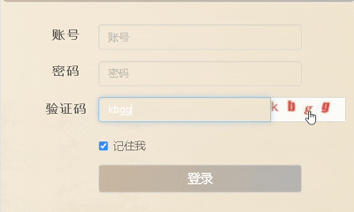

# 🖥️ 验证码OCR识别扩展

这是一个Chrome浏览器扩展，能够自动识别网页上的验证码图片，并将其发送到指定的OCR服务器进行处理，最后将识别结果自动填充到验证码输入框中。

## 🚀 功能特性

- 🌟 自动检测并识别页面加载时存在的验证码。
- 🖱️ 支持通过右键菜单选择任意图片发送至OCR服务器进行识别。
- 🔍 支持点击验证码图片触发自动识别与填充功能。
- 💡 提供友好的用户提示和错误处理机制。

## 📦安装指南

### 手动安装

1. 克隆此仓库或下载源代码压缩包。
2. 在Chrome浏览器中打开`chrome://extensions/`。
3. 开启“开发者模式”。
4. 点击“加载已解压的扩展程序”，选择本项目的根目录。
5. 安装完成，现在可以在支持的网站上使用该扩展了。

## 🛠使用方法

### 页面加载时自动识别

当页面加载完成后，如果存在符合规则的验证码图片（例如，其`src`, `id`, 或 `class`包含"captcha"关键字），插件会自动尝试识别并填充验证码。

### 右键菜单识别

1. 右键点击任何你想识别的图片。
2. 选择“发送验证码到OCR服务器”选项。
3. 插件将自动处理图片并显示结果。

### 点击图片识别

直接点击验证码图片即可触发自动识别与填充功能。



## 💻技术细节

- **前端**：使用JavaScript实现，包括content script和background script。
- **通信**：利用Chrome扩展的消息传递API (`chrome.runtime.sendMessage`) 实现前后端通信。
- **图像处理**：通过Canvas API将图片转换为data URL格式。
- **服务端**：需要配置一个OCR服务来接收图片数据并返回识别结果。

## ⚠注意事项

- 确保目标网站允许跨域资源共享(CORS)，以便正确获取图片资源。
- 如果遇到任何问题，请查看控制台输出以获取更多信息。

## 👥贡献者

感谢sml2h3作者提供的开源验证码识别库ddddocr。

## 📖 ️版本历史

```
2025.1.17 v1.0.2: 完善自动寻找验证码后填充功能，移除系统通知
2025.1.16 v1.0.1: 增加右键菜单识别验证码后自动填充
2025.1.15 v1.0.0: 初始发布版本
```
